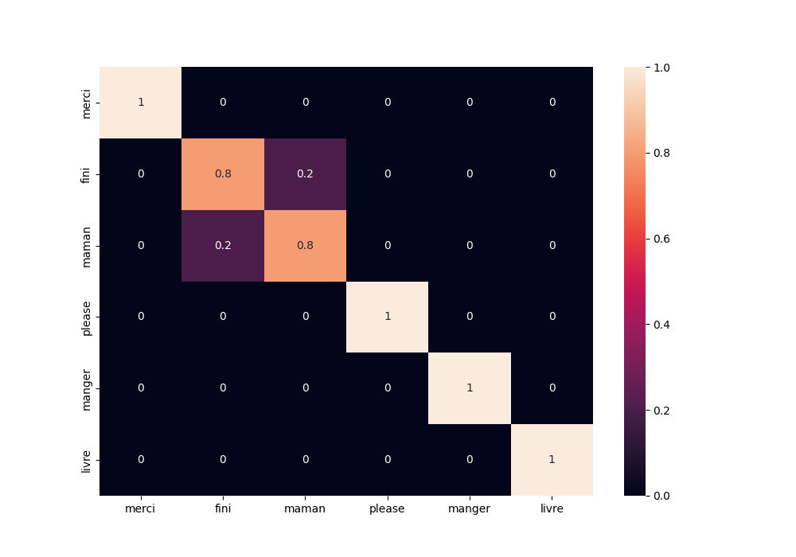

# Interactive Systems Project

## Hand gesture recognition for sign language

### Objecitf du projet
L'objectif de ce projet est de pouvoir parler en effectuant des mouvements avec son téléphone.
Une application concrète serait de permettre à des personnes muettes de pouvoir d'exprimer en langage des signes et qu'un haut-parleur puisse traduire ce qu'elles sont en train de dire, afin de pouvoir être compris par des personnes ne connaissant pas la langue des signes.

### Réalisation
Ce projet comprend trois parties : 
 - la création d'une application permettant la consitution d'une base de données de mouvements corrrespondant à des mots
 - la création et l'entraînement d'un modèle d'IA permettant de reconnaître les mouvements et de les associer à des mots
 - la création d'une application embarquant le modèle, qui, pour chaque mouvement réalisé, sortira sur le haut-parleur du téléphone le mot correspondant.
La première étape était de choisir les mots sur lesquels nous souhaitions travailler. Puisqu'il fallait réaliser la base de données nous-même, nous étions limités sur le nombre de mots. Nous avons choisi de travailler avec : merci, s'il-te-plaît, manger, livre, fini et maman.

### Application d'enregistrement
Nous avons utiliser Flutter pour réaliser l'application.
L'application dispose d'un bouton qui permet d'enregistrer des valeurs de l'accéléromètre du téléphone.
Nous avons enregistrer ces valeurs une vingtaine de fois pour chaque mouvement.

### Modèle
Nous avons tout d'abord traité les données enregistrées, en les coupant ou bien en les complétant avec des 0 afin qu'ils durent tous 3 secondes.
Pour chaque mouvement, nous avons séparé les données en 2 : une base d'entraînement avec 17 enregistrements et une base de test avec 5 enregistrements. 
Nous avons décidé de travailler avec un LSTM bidirectionnel. Ce modèle semblait parfaitement adapté pour la reconnaissance de mouvements.
Nous avons fait varié les hyperparamètres du modèle afin d'obtenir les meilleurs résultats. Nous les avons obtenu en utilisant 3 couches de 64 neurones.

### Matrice de confusion
Ce modèle a permi d'obtenir les résultats suivants : 

On remarque que les modèle prédit avec beaucoup de précision les mouvements réalisés.
Il existe une faible confusion entre les mots "fini" et "maman". Cela peut simplement s'expliquer par la taille très petite de notre base de données.
En enrichissant cette dernière, les résultats devraient être encore meilleurs.

### Application finale
L'application finale doit intégrer le modèle et, pour chaque mouvement, lire à haute-voix les résultats du modèle de manière audible.
Il s'agit d'une problématique assez classique, pour laquelle des soltions existent. Nous n'avons cependant pas réalisé cette application, mais la démonstration vidéo montre l'usage qui pourrait en être fait. 

